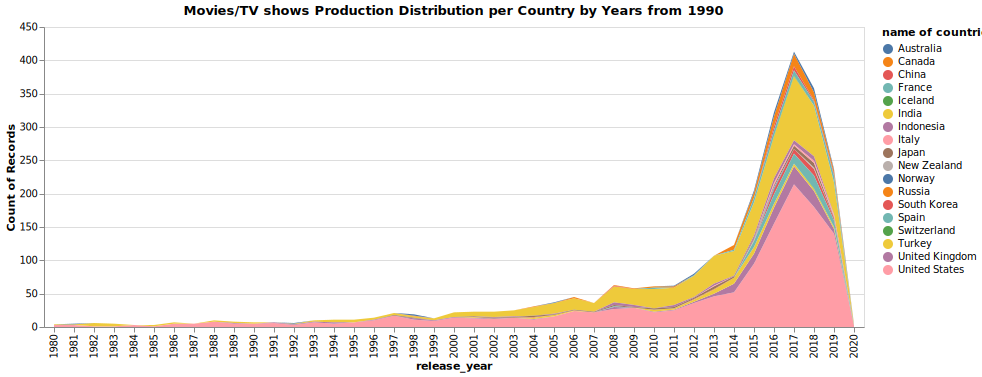
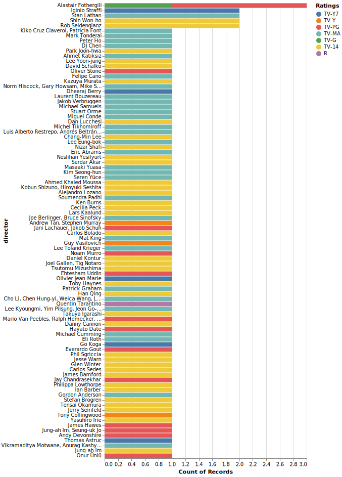

# A5—Altair basic plots
​
This repository is your starting point for the assignment. See the assignment instructions on the course website.

The source of the dataset is from Netflix company on [Kaggle](https://www.kaggle.com/shivamb/netflix-shows).
The python libraries used in this assignemnt are **Pandas** and **Altair**.

## Questions answered in this assignment 
1. What is the distribution of movies in Netflix library look like?
2. Who are the top directors of TV shows published on Netflix?

## Visualization 1

###### The explanation of this visualization 
For this visualization, I select some of the countries and try to visualize the growth of a number of movies starting from 1980. My hypothesis was that the sum of movies of all western countries should take a higher percentage in the number of movies, and the visualizatin proves my point. 

## Visualization 2

###### The explanation of this visualization 
I want to use the second visualization to show the top 100 directors of the TV shows collected in Netflix movie library. I wonder which directors and which types of TV shows Netflix will include in its library.

## Github repo
[Github Repo](https://github.com/NEU-DS-4200-S22-Students/a5--altair-basic-charts-shencode76).